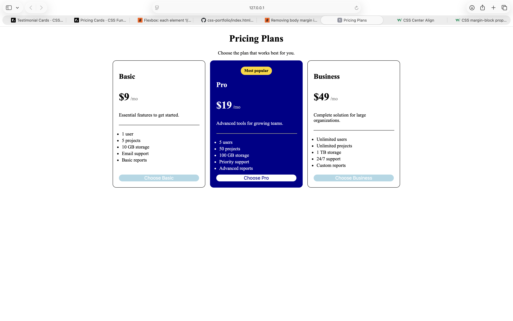
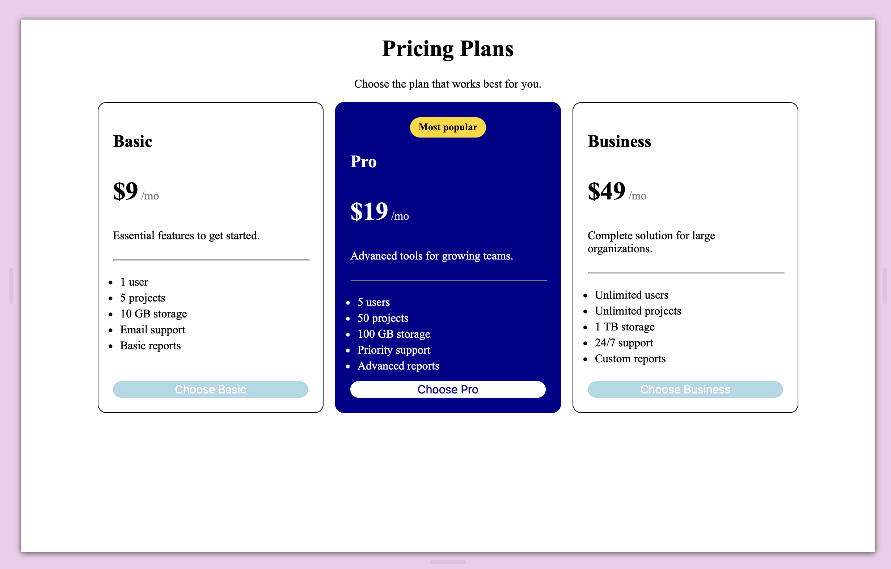
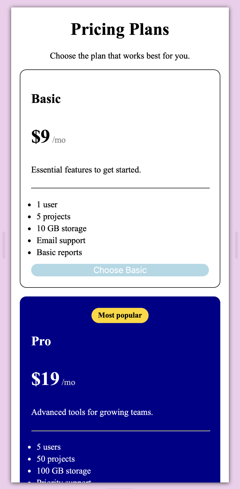

# Pricing Cards

A responsive pricing page displaying three subscription plans: Basic, Pro, and Business. The Pro plan is visually highlighted as the recommended option.

This project was created to practise building reusable card components, arranging content with Flexbox, and adapting a desktop layout for mobile screens.

## Features

- Three clearly presented subscription plans
- Highlighted “Most popular” plan
- Consistent card widths and heights
- Buttons aligned at the bottom of each card
- Responsive desktop, tablet, and mobile layouts
- Cards stack vertically on smaller screens
- Simple button hover effects

## Screenshots

### Desktop View



### Tablet View



### Mobile View



## Technologies Used

- **HTML5** — provides the semantic page and pricing-card structure
- **CSS3** — controls the colours, spacing, borders, typography and responsive layout
- **Flexbox** — creates equal-width cards and aligns their content
- **Media Queries** — changes the layout for smaller screens
- **Git and GitHub** — version control and project hosting

## What I Learned

- How to create reusable card styles with shared CSS classes
- How to give elements more than one class
- How `flex: 1` distributes available space equally between cards
- How `align-items: stretch` helps cards maintain equal heights
- How `margin-top: auto` positions buttons at the bottom of flexible cards
- How `<span>` elements can style separate parts of a price
- How to highlight one card using an additional modifier class
- How to use a media query to change a row into a vertical layout
- How to test a responsive page at desktop, tablet and mobile sizes

## Responsive Design

On desktop and tablet screens, the pricing cards appear next to one another in a horizontal row.

On screens up to 700 pixels wide, the cards stack vertically and use the available screen width.

## How to Run the Project

1. Clone the repository:

   ```bash
   git clone https://github.com/gaiiaa15/Pricing-Cards---CSS
   ```

2. Move into the project folder:

   ```bash
   cd Pricing-Cardss---CSS
   ```

3. Open `index.html` in a browser or run the project using the Live Server extension in Visual Studio Code.

## Project Structure

```text
pricing-cards/
├── images/
│-- desktop-view.png
│-- tablet-view.png
│-- mobile-view.png
├── index.html
├── style.css
└── README.md
```

## Possible Future Improvements

- Add monthly and yearly pricing options
- Make the plan buttons open signup pages
- Improve keyboard focus styles
- Add animations when users hover over a card
- Rebuild the cards as reusable JavaScript or React components

## Project Source

This project was completed as part of the [roadmap.sh Pricing Cards project](https://roadmap.sh/projects/pricing-cards).